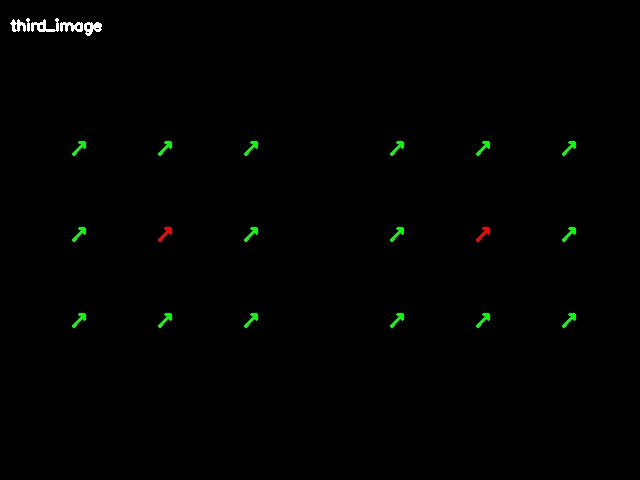

# Sensor Drawing

This repository contains scripts and utilities for visualizing sensor data and kinematics. 

## Features
- Kinematics calculation (`xram_kinematics.py`)
- Drawing and visualization (`draw_sensors.py`, `example_draw.py`)
- Transformations constants (`transforms/`)
- Sensor data normalization (`normalizer.py`), better to use idle sensors readings in the collected dataset (like first 3 seconds) to overwrite the constant offset since the sensor readings shift overtime.

## Example


## Draw Modes & Arguments

The `draw_on_image` method of `SensorDrawer` allows flexible rendering of sensor data on the image. It supports the following modes (passed via the `mode` parameter):
- `"points9_arrow"`: Draws 9 dots and 9 force arrows per side (requires `is_spatial=True`).
- `"points1_arrow"`: Draws 1 center dot and 1 averaged force arrow per side (requires `is_spatial=True`).
- `"points1_contact"`: Draws 1 center dot per side only when any sensor magnitude exceeds a threshold (`>= 0.05`). Supports spatial mapping and 2D overlay.
- `"points9_color"`: Draws 9 dots per side with no arrows. The dots are colored based on sensor XYZ readings mapped linearly to RGB. Supports spatial mapping and 2D overlay.
- `"bin_bar"`: Draws a thin horizontal bar (20 px tall) at the bottom corner for each finger (requires `is_spatial=False`). Bar width is proportional to the L2 norm of the averaged force across 9 sensors. The left bar grows rightward from the left edge; the right bar grows leftward from the right edge. Both are capped at half the image width to prevent overlap. Controlled by `bar_scale` (pixels per unit magnitude, default 300).
- `"third_image"`: Renders raw normalized sensor data on a black background with no camera or robot transforms. The left finger's 3×3 sensor array is drawn on the left half of the image and the right finger's on the right half. Each sensor is represented as an arrow: the (x, y) components set the direction and length in sensor frame (x right, y up), and z is encoded as arrow color (green = 0, red = 1). Accepts `x, y ∈ [-1, 1]` and `z ∈ [0, 1]`. The input image is ignored; the method returns a fresh black image of the same dimensions.

  

### Main Arguments
- `image`: The BGR/RGB numpy array (current version 640x480 only since camera K matrix is hardcoded with 640*480 resolution) to draw on.
- `angles`: List of 7 joint angles from xArm (degrees).
- `grip_pos`: Gripper position value.
- `dot_size`: Diameter for sensor dots.
- `is_spatial`: If `True`, points will be spatially mapped based on kinematics onto image space. If `False`, uses a simple 2D display at the corners of the image.
- `left_color` / `right_color`: RGBA colors for left and right sensor representations.
- `scale`: Multiplier for sensor local points positioning.
- `color_scale`: Multiplier applied to sensor xyz values before mapping to colors (used in `points9_color`).
- `arrow_length_scale` and `arrow_thickness`: Modifiers for 3D arrow visualizations based on sensor forces.

## Installation

Requires **NumPy 2.0+** (the saved transform files use the `numpy._core` internal format introduced in NumPy 2.x). The recommended way is to create a fresh environment:

```bash
conda create -n sensordrawing python=3.11 -y
conda activate sensordrawing
pip install -r requirements.txt
```

## Usage

Run the example drawing script to see the outputs:

```bash
python example_draw.py
```
